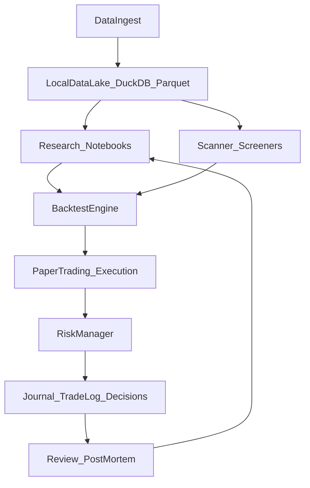

# 交易系统（Trading OS）MVP 计划

## 目标与边界

- **目标**：搭一套可持续迭代的系统，把“数据→研究→回测→纸交易执行→风控→记录复盘→再研究”做成闭环，先在模拟盘验证稳定性与流程，再接实盘。
- **边界**：不承诺战胜市场；我们用严格的评估与风控减少“回测幻觉”（lookahead、幸存者偏差、滑点/费用、过拟合）。

## 总体架构（先跑通一条链路）

我们采用 Python 为主（生态最完整），以 DuckDB/Parquet 做本地数据湖，以 CLI + Notebook + 文档库作为人机共用界面。

## 目录与“人机共用”约定

- 建议形成三个空间：
  - **代码与可复现研究**：`src/`, `notebooks/`, `configs/`
  - **知识与决策记录**：`docs/`, `journal/`（Markdown，结构化模板，便于你与我检索）
  - **数据与结果**：`data/`, `artifacts/`（大文件本地化，避免污染版本库）

## MVP 里程碑（2–3 周能落地）

- **M1：数据层统一（可复用）**
  - 接入至少两类：价格 K 线（多周期）+ 基础标的列表；先用可用的公共数据源（如 `yfinance`/`akshare` 等），后续可替换为付费源。
  - 定义统一 schema（symbol、exchange、timestamp、open/high/low/close/volume、adjustment 等）并落到 DuckDB/Parquet。
- **M2：回测与评估框架（防骗优先）**
  - 事件驱动或向量化回测（先选一种简单可维护的），支持费用、滑点、涨跌停/停牌（A股特性先以“可插拔规则”预留）。
  - 标准化报告：收益、最大回撤、夏普、换手、暴露、分组/分桶、分年度稳定性、走前验证（walk-forward）。
- **M3：纸交易执行 + 风控 + 全量记录**
  - 策略产生信号→生成订单→模拟撮合→持仓/现金更新→风控拦截→记录。
  - 风控最小集：单标的/单日最大亏损、总仓位上限、行业/市场暴露上限、冷却期、异常波动熔断。
  - 交易与决策日志：每笔交易“当时理由、预期、无效条件、复盘结论”。
- **M4：筛选器与研究工作流**
  - 屏幕筛选（估值/动量/质量/趋势/事件）+ 输出候选清单。
  - 固化研究模板（Markdown + Notebook），做到“想法可追溯”。

## 舆情/情绪（先做能用的）

- 第一阶段不追求全网 NLP：先做 **可扩展抓取 + 关键词/热度指标**（RSS/公告/财经新闻来源），把“信息输入→打标签→与交易关联”跑通。
- 第二阶段再上模型：中文情绪分类（finBERT/LLM summarization）与事件驱动回测。

## 实盘接入（后续里程碑）

- 纸交易稳定后，选择目标市场的券商/平台接口，做 `broker_adapter`：下单、撤单、成交回报、账户/持仓查询、行情订阅。
- 在接实盘前要补齐：幂等、重试、断线重连、订单状态机、时钟/时区、交易日历、告警。

## 需要你给我的最小配合（落地关键）

- 确认你未来最可能用的券商/平台（即便现在先纸交易），我会按它的限制设计接口层，避免重构。
- 给出你能接受的最大回撤/单笔风险的大致范围（比如 10%/20%/30%），风控参数会据此默认。

## 初版将落到的关键文件（拟）

- [`README.md`](../../README.md)：系统目标、快速开始、工作流
- [`pyproject.toml`](../../pyproject.toml)：依赖与工具链
- [`src/trading_os/data/`](../../src/trading_os/data/)：采集与数据湖
- [`src/trading_os/backtest/`](../../src/trading_os/backtest/)：回测引擎
- [`src/trading_os/execution/`](../../src/trading_os/execution/)：纸交易与（未来）券商适配层
- [`src/trading_os/risk/`](../../src/trading_os/risk/)：风控
- [`src/trading_os/journal/`](../../src/trading_os/journal/)：结构化日志与复盘模板
- [`docs/`](..) 、[`journal/`](../../journal/) 、[`notebooks/`](../../notebooks/)：知识库与研究

